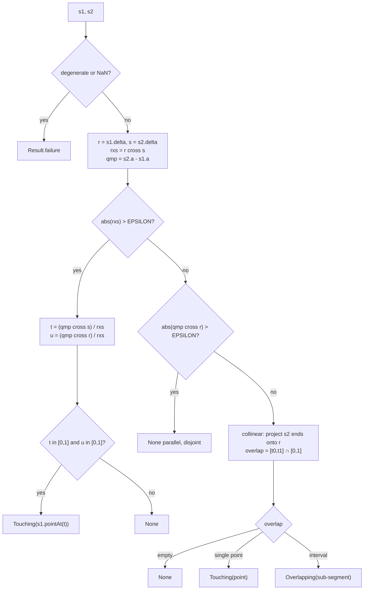

# Plan: issue #3 — geometry Segment / Ray / box primitives + intersection tests + Point vector ops

> Issue title uses "Aabb"; this plan ships the centre-origin box as
> **`CenteredBox`** behind a shared **`AxisAlignedBox`** interface (see **D1**).

## Header / Association

- **Covers:** `SpartanLaboratories/GeneralTools#3` — *"geometry: add Segment /
  Ray / Aabb + intersection tests + Point vector ops"* (label: `enhancement`, no
  open PR). Raised from `SpartanLabsGaming/MyGameTools` Phase 1 planning
  (`docs/phase-1-map-and-space-plan.md` §10); GameTools currently carries a
  private `com.spartanlabs.gaming.world.geometry` stopgap it wants to delete once
  this lands.
- **Branch:** `issue-3-geometry-primitives` (off updated `master`).
- **Commit:** implemented in commits `01b3c8d..5eb0043` on branch
  `issue-3-geometry-primitives` (commits 1–6 in §9); the `master` merge-commit
  SHA is appended by the manager after the PR merges.
- **PR:** `SpartanLaboratories/GeneralTools#5` —
  <https://github.com/SpartanLaboratories/GeneralTools/pull/5>.
- **Plan/impl linkage:** this document is committed **in the same commit as the
  first implementation stage** (commit 1 in §9) so `git log --follow` binds plan
  to code.
- **Status:** implemented on branch `issue-3-geometry-primitives` (working tree,
  uncommitted); `./gradlew build` + full test suite green (70 new geometry
  component tests). Pending version-control handling (commits, PR, release) and
  README/version already applied on the branch. Two slab-algorithm deviations
  from the original pseudocode were made to satisfy §6 — see §2.1 / §3.5 (now
  updated) and the notes below.
- **Target version:** `2.2.0` (minor — purely additive over the published
  `2.1.0`). Published to Maven Central as
  `io.github.spartanlaboratories:GeneralTools`. See Open decisions **D8**.
- **Related docs:** `docs/issue-1-color-methods.md` (precedent for the
  `testing.*` layout, `X.of(...)` clean-break factory, and version-bump
  handling); `SpartanLabsGaming/MyGameTools/docs/phase-1-map-and-space-plan.md`
  §10.

---

## 1. Context

### 1.1 Requirement

`com.spartanlabs.geometry` (GeneralTools `2.1.0`) ships only `Point`,
`Dimensions`, `Square`, and the `sealed` base `TwoDoubles`. It has **no** line
primitive, no intersection tests, and no vector algebra. GameTools Phase 1 needs:

1. **`Segment`, `Ray`, `CenteredBox`** value types (`CenteredBox` centre-origin,
   so there is no corner-vs-centre ambiguity), plus a shared **`AxisAlignedBox`**
   interface that both `CenteredBox` and the existing `Square` implement (**D1**).
2. **Intersection tests:** segment/segment, segment/box, ray/box (the box tests
   accept any `AxisAlignedBox`, so a `Square` works without conversion).
3. **Vector algebra on `Point`:** `dot`, `cross`, `length`, `normalized`,
   `projectedOnto`.

Downstream use: **swept collision resolution** (segment or ray of a moving body's
centre against a Minkowski-expanded static AABB → entry parameter) and
**tile-grid occlusion raycasts** (ray against per-tile AABBs).

### 1.2 What exists today (survey)

| File | Relevant shape |
|---|---|
| `src/main/kotlin/geometry/TwoDoubles.kt:13` | `sealed class TwoDoubles(var first, var second)` — mutable pair; overrides `equals` (type-sensitive) and `toString` but **not `hashCode`** (see 1.3). `divideBy` **throws** `IllegalArgumentException` on zero. |
| `src/main/kotlin/geometry/Point.kt:14` | `class Point(x, y) : TwoDoubles`. `x`/`y` are `var` (mutable). `distanceFrom` returns **`Result<Double>`** (`Result.failure(IllegalArgumentException)` on NaN) with an slf4j `log.warn`. |
| `src/main/kotlin/geometry/Point.kt:40` | `class Dimensions(width, height) : TwoDoubles`. |
| `src/main/kotlin/geometry/Square.kt:7` | `data class Square(var location: Point, var dimensions: Dimensions)` — KDoc says `location` is the **top-left corner**. GameTools `VisibleObject.collidesWith` treats a box origin as its **centre** — the ambiguity the issue calls out. This plan leaves the fields and constructor untouched and adds `: AxisAlignedBox` with computed `min`/`max`/`center`/`size`/`contains` (**D1**) — additive, non-breaking. |
| `src/main/kotlin/generaltools/Color.kt` | Precedent for this repo's house style post-issue-1: `Result` return type unused here, but `Color.of(...)` is the clean-break clamping-factory pattern; KDoc with `@param`/`@return`/`@throws`; restored class KDoc. |

House conventions observed:

- **Error handling:** newer code (`Point.distanceFrom`) returns `Result` for
  bad-value input and logs via a file-level `private val log =
  LoggerFactory.getLogger("com.spartanlabs.geometry.<Name>")`. Older code
  (`TwoDoubles.divideBy`) throws. The global `~/.claude/CLAUDE.md` and the issue
  both call for **`Result`-based** handling for degenerate input — this plan
  follows `distanceFrom`.
- **Tests:** one class per file; `private val log =
  LoggerFactory.getLogger(<Class>::class.java)`; a `log.info("Running …")` line
  first in every `@Test`; `kotlin.test` assertions; `@Tag("component")` on
  Level-2 suites; new suites live under
  `src/test/kotlin/com/spartanlabs/testing/component/<prod-subpackage>/` in
  package `com.spartanlabs.testing.component.<prod-subpackage>` (established by
  `ColorTest` in issue #1). The old flat `src/test/kotlin/geometry/` suites have
  a package-vs-directory mismatch — **pre-existing, out of scope**.
- `build.gradle.kts` runs `useJUnitPlatform()`; `kotlin.test` maps to JUnit 5;
  `@Tag` works but no per-tag Gradle task exists yet (follow-up).

### 1.3 Defect found while surveying — `TwoDoubles` has no `hashCode()`

`TwoDoubles.kt:60` overrides `equals` but there is **no matching `hashCode()`
override**. Two equal `Point`s (or `Square`s) therefore usually return different
hash codes, so today `Square` is already broken as a `HashMap` key / `HashSet`
element. The new `Segment` / `Ray` / `CenteredBox` types compose `Point`/`Dimensions`
and are intended to be usable as map keys (tile → occluder caches in GameTools),
so this must be fixed as part of this work. It is a contract fix, not an API
break. See Open decisions **D-hash** (folded in, not blocking) and §7.

Per `~/.claude/CLAUDE.md` ("Spartan Labs libraries — surface issues"): this is a
pre-existing defect in a `SpartanLaboratories/*` repo. It is small and directly
undermines the types this issue adds, so it is folded into this plan rather than
filed separately — flag it in the PR description.

### 1.4 Acceptance criteria (inferred)

- `com.spartanlabs.geometry` exposes `Segment`, `Ray`, `CenteredBox` as immutable
  value types with `equals`/`hashCode`/`copy`, plus small navigation helpers
  (`pointAt`, `length`, `min`/`max`, `contains`).
- `com.spartanlabs.geometry` exposes an `AxisAlignedBox` interface
  (`min`, `max`, `center`, `size`, `contains`); `CenteredBox` and `Square` both
  implement it, and the box-intersection functions accept it.
- `Point` gains `dot`, `cross`, `length`, `lengthSquared`, `normalized()`,
  `projectedOnto` (see §3.1 for member-vs-extension — **D2**).
- `segmentIntersectsSegment`, `segmentIntersectsBox`, `rayIntersectsBox` exist,
  return `Result`, and correctly handle the degenerate / collinear / parallel /
  ray-on-face cases enumerated in §4 and §6.
- Every new public type and function has Level-2 component coverage in the
  5-level hierarchy at the correct `testing.component.geometry` path.
- `TwoDoubles.hashCode()` is consistent with `equals`; a test pins it.
- README `com.spartanlabs.geometry` section and Maven coordinates updated to
  `2.2.0`; `build.gradle.kts` coordinates bumped to `2.2.0`.
- No **breaking** change to any published `2.1.0` signature. `Square` keeps its
  fields and constructor; it gains `: AxisAlignedBox` and computed
  `min`/`max`/`center`/`size`/`contains` members plus a KDoc clarification — all
  additive (**D1**).

---

## 2. Prior art & best practices

Research done for this plan. Sources marked **[fetched]** were read during
planning; **[ref]** are canonical references drawn on from prior knowledge. The
cited routines (Tavianator slab / NaN handling, Bourke & Rees perp-dot, Ericson
RTCD, Quílez intersectors) are stable, canonical results; re-verify against a
live fetch only if an implementer hits a case the truth tables in §6 don't
pin down.

### 2.1 Ray / segment vs AABB — the slab method

- **Tavian Barnes, "Fast, Branchless Ray/Bounding Box Intersections" (2011)**
  and **"…, Part 2: NaNs" (2015)** — `tavianator.com` **[fetched]**.
  - Treat the box as three pairs of parallel planes ("slabs"). Per axis `i`:
    `t1 = (box.min[i] - o[i]) / d[i]`, `t2 = (box.max[i] - o[i]) / d[i]`;
    accumulate `tmin = max(tmin, min(t1, t2))`, `tmax = min(tmax, max(t1, t2))`.
    Hit iff `tmax >= tmin` (and `tmax >= 0` for a forward ray).
  - **Division by zero is fine under IEEE-754:** a ray parallel to axis `i`
    gives `d[i] == 0` → `t1,t2 = ±∞`, which leaves that slab's constraint inert
    if the origin is between the planes and fails the test if it is outside. Do
    **not** branch on `d[i] == 0`.
  - **The one hazard is `0 * ∞ = NaN`**, when the origin lies exactly on a slab
    plane. Plain `min`/`max` semantics differ: SSE `minps`/`maxps` return the
    second operand on NaN (inconsistent — some grazing rays wrongly "hit");
    `java.lang.Math.min`/`max` (hence Kotlin `minOf`/`maxOf` on `Double`)
    **propagate NaN**, which makes `tmax >= tmin` false → clean miss.
  - The 2015 post also gives an extra-robust form that re-clamps intermediates
    (`tmin = max(tmin, min(min(t1,t2), tmax))`,
    `tmax = min(tmax, max(max(t1,t2), tmin))`). **This plan does _not_ use that
    form** — the re-clamp's `max(max(t1,t2), tmin)` pulls a `−∞` exit
    parameter (produced when a ray runs parallel to a face and *outside* the
    slab) back up to `tmin`, turning a clean miss into a false hit (verified
    against §6 case "ray parallel to a face, passing outside the slab"). Use the
    **plain** NaN-propagating form — `tmin = max(tmin, min(t1,t2))`,
    `tmax = min(tmax, max(t1,t2))` — and document the reliance on IEEE (not SSE)
    `min`/`max` semantics. The `0*∞` grazing case is then handled at the final
    test: phrase it `if (!(tmax >= max(tmin, 0.0))) return miss` so a `NaN`
    interval bound yields a deterministic miss.
- **Iñigo Quílez, "Intersectors"** — `iquilezles.org/articles/intersectors`
  **[fetched]**. Same slab routine; returns entry `tN` and exit `tF`;
  distinguishes *miss* (`tN > tF || tF < 0`), *origin inside* (`tN < 0`), and
  *origin outside* (`tN >= 0`). Advice: these routines are most robust when the
  origin is outside the primitive; otherwise accept a small perf cost for
  clamping. Confirms the **entry/exit parametric interval** as the right return
  shape.
- **Christer Ericson, *Real-Time Collision Detection* (2005), §5.3.3 / §5.3.8**
  **[ref]**. Segment vs AABB = the slab test with the parameter clamped to
  `[0, 1]` instead of `[0, ∞)`; `IntersectRayAABB` returns `bool` plus `tmin`
  and the hit point `q`. Uses an `EPSILON` guard on `|d[i]|` for the
  parallel-and-outside early-out (an alternative to relying on `±∞`).

### 2.2 Segment / segment in 2D

- **Paul Bourke, "Intersection of two line segments in 2D"** —
  `paulbourke.net/geometry/pointlineplane` **[fetched]**. Parametric
  `Pa = P1 + ua·(P2−P1)`, `Pb = P3 + ub·(P4−P3)`. Solve `Pa = Pb`:
  `denom = (y4−y3)(x2−x1) − (x4−x3)(y2−y1)`. `denom == 0` ⇒ parallel;
  `denom == 0` **and** both numerators `== 0` ⇒ collinear/coincident. For
  *segments* (not lines) require `ua ∈ [0,1]` **and** `ub ∈ [0,1]`.
- **Gareth Rees' cross-product formulation** (widely cited; Stack Overflow
  #563198) **[ref]**. `p = s1.a`, `r = s1.b − s1.a`, `q = s2.a`,
  `s = s2.b − s2.a`. `rxs = r × s`, `t = (q−p) × s / rxs`,
  `u = (q−p) × r / rxs`. Four cases:
  1. `rxs ≈ 0` and `(q−p) × r ≈ 0` → **collinear**: project `s2`'s endpoints
     onto `r` (`t0 = (q−p)·r / (r·r)`, `t1 = t0 + (s·r)/(r·r)`), intersect
     `[min,max]` with `[0,1]` → empty (None) / single point (Touching) /
     interval (Overlapping).
  2. `rxs ≈ 0` and `(q−p) × r ≉ 0` → **parallel, disjoint** → None.
  3. `rxs ≉ 0` and `t ∈ [0,1]` and `u ∈ [0,1]` → **proper crossing** at
     `p + t·r`.
  4. otherwise → None (lines cross outside the segments).
- **GeeksforGeeks / CLRS orientation predicate** —
  `geeksforgeeks.org/dsa/check-if-two-given-line-segments-intersect` **[fetched]**.
  `orient(a,b,c) = sign((b.y−a.y)(c.x−b.x) − (b.x−a.x)(c.y−b.y))`. General case:
  segments cross iff `orient(p1,q1,p2) != orient(p1,q1,q2)` **and**
  `orient(p2,q2,p1) != orient(p2,q2,q1)`. Collinear case: `on-segment` bounds
  checks. This is the cheaper **boolean** predicate — used inside
  `segmentIntersectsBox` (segment vs the box's four edges) and as a
  cross-check in tests, but `segmentIntersectsSegment` needs the parametric
  form to return the point.
- **JTS Topology Suite `RobustLineIntersector` / `Orientation.index`** **[ref]**.
  Mature libraries return an **enum-like result**, not a nullable point:
  `NO_INTERSECTION` / `POINT_INTERSECTION` / `COLLINEAR_INTERSECTION`. JTS uses
  exact/adaptive-precision predicates (Shewchuk) for the orientation sign to
  avoid robustness failures near-collinear. For a game-tools library at typical
  world scales a documented absolute `EPSILON` is adequate; exact predicates are
  noted as a **future enhancement** (§10), not this issue.

### 2.3 API shape — how mature 2D libraries present this

| Library | Shape |
|---|---|
| `java.awt.geom.Line2D` | `linesIntersect(...)` / `intersectsLine(...)` → `boolean`; no point. |
| libGDX `Intersector` | `intersectSegments(p1,p2,p3,p4, Vector2 out)` → `boolean`, writes point to an out-param; `intersectRayBounds(ray, bbox, Vector3 out)`. |
| dyn4j | `Segment` is a first-class `Convex` shape; ray casting via `raycast(Ray, length, Raycast result)` → `boolean` + a result object carrying distance + point + normal. |
| JTS | `RobustLineIntersector` object with `getIntersectionNum()` + `getIntersection(i)`. |
| Ericson RTCD | `bool` + out `t` + out point `q`. |

**Takeaways that drive this design:**

1. Separate the **predicate** ("do they meet?", `Boolean`) from the
   **locator** ("where / how far?", a point or a parametric `t`). This issue
   asks for a mix; keep segment/AABB as a predicate and ray/AABB as a locator
   (entry `t`), matching the issue.
2. For segment/segment, return a **sum type** (None / Touching / Overlapping),
   not `Point?` — the collinear-overlap case is real (a ray running along a wall
   edge; a sliding contact in swept collision) and `Point?` cannot express it.
   This is a clean-break-friendly choice made now while the API is unpublished.
3. Parameterise rays by `t` along `direction`; `direction` **need not be unit**
   (issue requirement). Document that the returned `t` is in units of
   `|direction|`; give callers `Ray.pointAt(t)` and `Ray.unit()` so they rarely
   need to care (**D5**).
4. Centralise the tolerance as one documented `const val EPSILON` (**D7**).
5. Degenerate geometry (zero-length segment, zero-direction ray, non-finite
   coordinates, negative/NaN half-extents) → `Result.failure`, mirroring
   `Point.distanceFrom` (**D4**).

---

## 3. Design

### 3.1 Vector algebra on `Point`

New file `src/main/kotlin/geometry/Vectors.kt`, package
`com.spartanlabs.geometry`. **Extension** functions/properties on `Point` (not
members, not on `TwoDoubles`) — see **D2**. Rationale: `cross` / `normalized` /
`projectedOnto` are meaningless on `Dimensions`, so they must not sit on the
shared `sealed` base; keeping them in one file groups the whole vector surface
and lets `length` be a clean `val` extension property. `distanceFrom` stays a
member (untouched).

```kotlin
package com.spartanlabs.geometry

/** Absolute tolerance for parallel / collinear / on-boundary tests. See KDoc. */
const val EPSILON: Double = 1e-10

/** Dot product `x*other.x + y*other.y`. Total on finite input; NaN propagates. */
infix fun Point.dot(other: Point): Double

/** 2D scalar cross (perp-dot) `x*other.y - y*other.x`. Sign = orientation. */
infix fun Point.cross(other: Point): Double

/** Euclidean magnitude `sqrt(x*x + y*y)`. NaN if this contains NaN. */
val Point.length: Double

/** `x*x + y*y` — cheaper than [length]; use for comparisons. */
val Point.lengthSquared: Double

/**
 * This vector scaled to unit length.
 *
 * @return `Result.failure(IllegalArgumentException)` if this contains NaN or its
 *   length is `< EPSILON` (direction undefined); otherwise `Result.success`.
 */
fun Point.normalized(): Result<Point>

/**
 * The vector projection of this onto [axis]:
 * `axis * (this dot axis) / (axis dot axis)`.
 *
 * @return the zero vector `Point(0.0, 0.0)` if [axis] length `< EPSILON`
 *   (documented, total — not a `Result`).
 */
infix fun Point.projectedOnto(axis: Point): Point
```

- `normalized()` returns `Result` because a zero vector has no direction — this
  is the same degeneracy `TwoDoubles.divideBy` guards (it throws; we return
  `Result`, consistent with `distanceFrom`). Logs via the file `log`.
- `dot` / `cross` / `length` / `lengthSquared` / `projectedOnto` are **total**
  on finite input and return plain values; NaN in → NaN out, documented. No
  `Result` ceremony for operations that are always defined (**D4**).

### 3.2 `Segment`

New file `src/main/kotlin/geometry/Segment.kt`.

```kotlin
/**
 * A directed line segment from [a] to [b]. Value type.
 *
 * [Point] is mutable; do not mutate an instance after handing it to a Segment.
 * Treat Segment as immutable. (See plan §7 / Open decision D-mut.)
 */
data class Segment(val a: Point, val b: Point) {
    /** `b - a` as a direction vector (not normalised). */
    val delta: Point                 // Point(b.x - a.x, b.y - a.y)
    val length: Double               // delta.length
    val lengthSquared: Double        // delta.lengthSquared

    /** Point at parameter [t]: `a + t*(b - a)`. `t=0` → [a], `t=1` → [b]. */
    fun pointAt(t: Double): Point

    /**
     * This segment as a [Ray] from [a].
     * @return failure if the segment is degenerate (length `< EPSILON`) or
     *   contains NaN.
     */
    fun asRay(): Result<Ray>
}
```

### 3.3 `Ray`

New file `src/main/kotlin/geometry/Ray.kt`.

```kotlin
/**
 * A half-line from [origin] along [direction]. [direction] need not be unit
 * length; parametric distances returned by intersection tests are in units of
 * `direction.length`. Value type; see Segment KDoc re: Point mutability.
 */
data class Ray(val origin: Point, val direction: Point) {
    /** Point at parameter [t]: `origin + t*direction`. */
    fun pointAt(t: Double): Point

    /**
     * A copy with [direction] normalised, so returned `t` values become true
     * world distances.
     * @return failure if [direction] length `< EPSILON` or contains NaN.
     */
    fun unit(): Result<Ray>
}
```

### 3.4 `AxisAlignedBox` interface + `CenteredBox` (D1)

New file `src/main/kotlin/geometry/AxisAlignedBox.kt` — the shared read-only
contract for both box types, so the intersection functions and any consumer can
treat a top-left `Square` and a centre-origin `CenteredBox` uniformly.

```kotlin
/**
 * Read-only contract common to every axis-aligned rectangle in this package,
 * regardless of how it stores its origin. All members are derived; implementors
 * add no state beyond their own fields.
 */
interface AxisAlignedBox {
    /** The corner with the smallest x and y. */
    val min: Point
    /** The corner with the largest x and y. */
    val max: Point
    /** The geometric centre: `(min + max) / 2`. */
    val center: Point
    /** Width and height (`max - min`), always non-negative for a valid box. */
    val size: Dimensions

    /** True if [p] is inside or on the boundary (`min.x <= p.x <= max.x`, likewise y). */
    infix fun contains(p: Point): Boolean   // default implementation in the interface
}
```

`contains` gets a default implementation in the interface (pure `min`/`max`
comparison) so implementors only supply `min`, `max`, `center`, `size`.

New file `src/main/kotlin/geometry/CenteredBox.kt` — centre-origin, unambiguous.

```kotlin
/**
 * An axis-aligned box centred at [center] with the given [halfExtents]
 * (half-width, half-height). Centre-origin, so there is no corner-vs-centre
 * ambiguity (contrast [Square], which is top-left-origin). Value type.
 */
data class CenteredBox(
    override val center: Point,      // constructor property satisfies the interface member
    val halfExtents: Dimensions,
) : AxisAlignedBox {
    override val min: Point       // Point(center.x - halfExtents.width, center.y - halfExtents.height)
    override val max: Point       // Point(center.x + halfExtents.width, center.y + halfExtents.height)
    override val size: Dimensions // Dimensions(halfExtents.width * 2, halfExtents.height * 2)

    companion object {
        /** Build from opposite corners (order-independent). */
        fun fromCorners(c1: Point, c2: Point): CenteredBox
    }
}
```

`Square` (in `Square.kt`) gains `: AxisAlignedBox`:

```kotlin
data class Square(var location: Point = ..., var dimensions: Dimensions = ...) : AxisAlignedBox {
    override val min: Point       // location (top-left is already the min corner)
    override val max: Point       // Point(location.x + dimensions.width, location.y + dimensions.height)
    override val center: Point    // Point(location.x + dimensions.width / 2, location.y + dimensions.height / 2)
    override val size: Dimensions // dimensions
}
```

Optional convenience converters (keep — trivial, ease the GameTools migration,
**D9**):

```kotlin
/** This [Square] as a [CenteredBox] with the same footprint. */
fun Square.toCenteredBox(): CenteredBox

/** This [AxisAlignedBox] as a top-left-origin [Square] with the same footprint. */
fun AxisAlignedBox.toSquare(): Square
```

Negative or NaN `halfExtents` / `dimensions` are **not** rejected at construction
(consistent with `Point`/`Dimensions`, which validate nothing) but the
intersection functions reject a box whose `size` is negative or non-finite
(§4, **D4**).

### 3.5 Intersection functions

New file `src/main/kotlin/geometry/Intersections.kt`, package-level functions,
file `private val log`.

```kotlin
/** Result of [segmentIntersectsSegment]. */
sealed interface SegmentIntersection {
    /** The segments do not meet. */
    data object None : SegmentIntersection
    /** The segments meet at exactly one [point] (proper crossing or shared endpoint). */
    data class Touching(val point: Point) : SegmentIntersection
    /** The segments are collinear and overlap along [segment]. */
    data class Overlapping(val segment: Segment) : SegmentIntersection
}

/**
 * 2D segment/segment intersection via the perp-dot (cross-product) method.
 *
 * @return failure if either segment is degenerate (length `< EPSILON`) or
 *   contains NaN; otherwise one of [SegmentIntersection.None],
 *   [SegmentIntersection.Touching], [SegmentIntersection.Overlapping].
 */
fun segmentIntersectsSegment(s1: Segment, s2: Segment): Result<SegmentIntersection>

/**
 * True if any part of [s] lies inside or on [box]. Slab test with the
 * parameter clamped to `[0, 1]`, plus an endpoint-inside short-circuit.
 * [box] is any [AxisAlignedBox] — a [Square] or a [CenteredBox].
 *
 * @return failure if [s] is degenerate / non-finite or [box] has negative or
 *   non-finite [AxisAlignedBox.size]; otherwise the boolean.
 */
fun segmentIntersectsBox(s: Segment, box: AxisAlignedBox): Result<Boolean>

/**
 * Parametric entry distance of ray [r] into [box] (slab method, NaN-safe).
 * [box] is any [AxisAlignedBox] — a [Square] or a [CenteredBox].
 *
 * @return failure for a zero-direction / non-finite ray or a negative /
 *   non-finite [box]; `Result.success(null)` on a clean miss or a box entirely
 *   behind the origin; `Result.success(0.0)` if the origin is inside the box;
 *   otherwise `Result.success(tEntry)` where `tEntry > 0` is in units of
 *   `r.direction.length` (use [Ray.pointAt] or [Ray.unit]).
 */
fun rayIntersectsBox(r: Ray, box: AxisAlignedBox): Result<Double?>
```

#### `segmentIntersectsSegment` — decision flow



#### `rayIntersectsBox` — core (NaN-safe slab)

```kotlin
// invD may be ±Infinity for an axis-parallel ray — intentional (IEEE-754).
val invDx = 1.0 / r.direction.x
val invDy = 1.0 / r.direction.y
var tmin = Double.NEGATIVE_INFINITY
var tmax = Double.POSITIVE_INFINITY

val tx1 = (box.min.x - r.origin.x) * invDx
val tx2 = (box.max.x - r.origin.x) * invDx
// minOf/maxOf on Double delegate to java.lang.Math.min/max, which PROPAGATE NaN
// (unlike SSE minps/maxps). Use the PLAIN slab form, not the re-clamp form —
// the re-clamp turns a parallel-and-outside miss into a false hit (§2.1).
tmin = maxOf(tmin, minOf(tx1, tx2))
tmax = minOf(tmax, maxOf(tx1, tx2))
// ... same for y ...

// A NaN bound (0*∞ grazing case, origin exactly on a face, direction along it)
// makes this comparison false → deterministic miss. Note the `!(… >= …)` form.
if (!(tmax >= maxOf(tmin, 0.0))) return Result.success(null)  // miss / fully behind / grazing
return Result.success(if (tmin < 0.0) 0.0 else tmin)          // origin inside → 0.0
```

`segmentIntersectsBox` runs the same plain slab test along the segment's own
parameterisation, with `tmin`/`tmax` seeded to `0.0`/`1.0` (the segment's
range) and the final test written `tmax >= tmin`, short-circuited by
`box contains s.a || box contains s.b` for the fully-inside case. Both box
functions read only `box.min` / `box.max`, so they are agnostic to how the box
stores its origin.

### 3.6 `TwoDoubles.hashCode()` (defect fix, §1.3)

```kotlin
// equals() is type-sensitive (other.javaClass != this.javaClass -> false), so
// fold the concrete class into the hash to match.
override fun hashCode(): Int =
    31 * (31 * javaClass.hashCode() + first.hashCode()) + second.hashCode()
```

Makes `Point`, `Dimensions` (and transitively `Square`, `Segment`, `Ray`,
`CenteredBox`) correct in hash-based collections.

### 3.7 `Square` — implement `AxisAlignedBox`, clarify KDoc (no breaking change)

`Square.kt`:

- Add `: AxisAlignedBox` and the four computed overrides (`min` = `location`,
  `max`, `center`, `size` = `dimensions`) — see §3.4. `contains` comes from the
  interface default. Fields and constructor are untouched, so this is additive.
- Expand the class + `location` KDoc to state explicitly that `location` is the
  **top-left corner** (i.e. `min`) in this library's convention, and point to
  `CenteredBox` / `Square.toCenteredBox()` for centre-origin work.

This resolves the issue's "which convention?" question **without a breaking
change** (**D1**).

### 3.8 Alternatives considered

| Alternative | Rejected because |
|---|---|
| Redefine `Square.location` as the centre | Breaking change to a published (`2.1.0`) type → forces `3.0.0`; silently flips the meaning for existing consumers. Adding `CenteredBox` + the shared `AxisAlignedBox` interface is additive. (**D1**) |
| Name the new type `Aabb` | Acronym / jargon; the package's house style is plain English (`Point`, `Square`, `Dimensions`). `CenteredBox` says what it is. (**D1**) |
| Two independent box types with no shared supertype | Forces `toSquare()` / `toCenteredBox()` conversions at every boundary and duplicates `min`/`max`/`contains`. The `AxisAlignedBox` interface lets one intersection function serve both. (**D1**) |
| Put vector ops on `TwoDoubles` | `cross`/`normalized`/`projectedOnto` are nonsense for `Dimensions`; the base is `sealed` and shared. (**D2**) |
| `segmentIntersectsSegment(...): Result<Point?>` (issue's sketch) | Cannot represent collinear overlap, which swept-collision sliding contacts and along-wall rays actually produce. Sum type follows JTS. (**D3**) |
| Require unit `direction` in the `Ray` constructor (`require`) | Kills the "ray from A toward B" convenience; forces every caller to normalise; throws instead of `Result`. Keep non-unit + document `t` units + `Ray.unit()`. (**D5**) |
| Branch on `direction.component == 0.0` in the slab test | The IEEE `±∞` behaviour handles axis-parallel rays for free; branching is slower and misses the `0*∞` case anyway. Use the plain NaN-propagating slab form + the `!(tmax >= max(tmin, 0.0))` final test. (§2.1) |
| Tavianator's re-clamp ("double-clamp") slab form | Turns a parallel-and-outside miss into a false hit — `max(max(t1,t2), tmin)` lifts a `−∞` exit back to `tmin`. Fails §6. Use the plain form. (§2.1) |
| Exact/adaptive orientation predicates (Shewchuk / JTS) | Overkill for game-tools world scales; large dependency/complexity. Documented `EPSILON` + a "pre-translate near origin for huge coordinates" note. Noted as a future enhancement. (**D7**, §10) |
| Throw `IllegalArgumentException` (like `TwoDoubles.divideBy`) on degenerate input | The newer house style (`Point.distanceFrom`) and both `CLAUDE.md` and the issue prefer `Result`. (**D4**) |
| One big `geometry.kt` file | Repo keeps one primary type per file (`Point.kt`, `Square.kt`, `TwoDoubles.kt`). Match it. |

### 3.9 Staging

Independently landable, in order (see §9 for commits):

1. **Vector algebra** (`Vectors.kt`) + `TwoDoubles.hashCode()` — self-contained;
   nothing depends on the primitives.
2. **Primitives** (`AxisAlignedBox`, `Segment`, `Ray`, `CenteredBox`,
   `Square: AxisAlignedBox`, converters) — depend on stage 1 (`length`, `dot`).
3. **Intersections** (`Intersections.kt`) — depend on stages 1–2.
4. Tests, README, version bump.

Each stage compiles and passes tests on its own; the PR can be reviewed
stage-by-stage or split into a short series if the reviewer prefers.

---

## 4. Degenerate-input contract (single source of truth)

| Function | Failure (`Result.failure(IllegalArgumentException)`, logged `warn`) | Benign edge (success) |
|---|---|---|
| `Point.normalized()` | contains NaN; `length < EPSILON` | — |
| `Point.projectedOnto` | — (total) | `axis` length `< EPSILON` → `Point(0.0, 0.0)` |
| `Segment.asRay()` | `length < EPSILON`; contains NaN | — |
| `Ray.unit()` | `direction` length `< EPSILON`; non-finite | — |
| `segmentIntersectsSegment` | either segment `length < EPSILON`; any NaN coord | parallel disjoint → `None`; collinear touch → `Touching`; collinear overlap → `Overlapping` |
| `segmentIntersectsBox` | segment degenerate / NaN; `box.size` negative or non-finite | segment fully outside → `success(false)` |
| `rayIntersectsBox` | `direction` length `< EPSILON`; any NaN/∞ in ray or box; `box.size` negative or non-finite | clean miss / box behind → `success(null)`; origin inside → `success(0.0)` |

`box.size == 0` on an axis (a degenerate line/point box) is **allowed**
(success) — it is a valid limit; only *negative* / *non-finite* size fails.
(`CenteredBox.halfExtents` and `Square.dimensions` are the underlying fields;
neither type validates at construction — the check is `box.size` in the
intersection functions.)

---

## 5. File-by-file changes

### New — `src/main/kotlin/geometry/Vectors.kt`

- `const val EPSILON: Double = 1e-10` with KDoc explaining scope (parallel /
  collinear / on-boundary tolerance) and the large-coordinate caveat.
- `private val log = LoggerFactory.getLogger("com.spartanlabs.geometry.Vectors")`.
- `dot`, `cross` (infix), `length`, `lengthSquared` (`val` extension props),
  `normalized(): Result<Point>`, `projectedOnto` (infix). Signatures §3.1.
- KDoc on every symbol (`@return`, failure conditions). Level-1 inline comment on
  the `normalized` zero-length guard.

### New — `src/main/kotlin/geometry/Segment.kt`

- `data class Segment(val a: Point, val b: Point)` + `delta`, `length`,
  `lengthSquared`, `pointAt(t)`, `asRay(): Result<Ray>`. Signatures §3.2.
- Class KDoc incl. the "Point is mutable; treat Segment as immutable" note.

### New — `src/main/kotlin/geometry/Ray.kt`

- `data class Ray(val origin: Point, val direction: Point)` + `pointAt(t)`,
  `unit(): Result<Ray>`. Signatures §3.3. Class KDoc states the non-unit
  `direction` / `t`-units contract.

### New — `src/main/kotlin/geometry/AxisAlignedBox.kt`

- `interface AxisAlignedBox` with `val min`, `val max`, `val center`,
  `val size`, and `infix fun contains(p: Point): Boolean` **with a default
  implementation** (pure `min`/`max` comparison). Signatures §3.4.
- KDoc on the interface and every member.

### New — `src/main/kotlin/geometry/CenteredBox.kt`

- `data class CenteredBox(override val center: Point, val halfExtents: Dimensions) : AxisAlignedBox`
  + `override` `min` / `max` / `size`, `companion.fromCorners`. Signatures §3.4.
- Extension converters `Square.toCenteredBox()`, `AxisAlignedBox.toSquare()`.
- Class KDoc incl. the "Point is mutable; treat as immutable" note and the
  contrast with `Square` (top-left-origin).

### New — `src/main/kotlin/geometry/Intersections.kt`

- `sealed interface SegmentIntersection` with `None` / `Touching` / `Overlapping`.
- `segmentIntersectsSegment`, `segmentIntersectsBox`, `rayIntersectsBox`
  (the box params are `AxisAlignedBox`).
  Signatures §3.5; algorithms §3.5 + §2.
- `private val log = LoggerFactory.getLogger("com.spartanlabs.geometry.Intersections")`.
- `//region` blocks per function group; Level-1 comments on the NaN/IEEE
  reliance and the collinear projection.

### Edit — `src/main/kotlin/geometry/TwoDoubles.kt`

- Add `override fun hashCode(): Int` (§3.6), placed next to `equals`. Nothing
  else. Update the `equals` KDoc to mention the paired `hashCode`.

### Edit — `src/main/kotlin/geometry/Square.kt`

- Add `: AxisAlignedBox` and the computed overrides `min` (= `location`), `max`,
  `center`, `size` (= `dimensions`). `contains` inherited from the interface
  default. Fields / constructor unchanged → additive.
- KDoc: state the top-left-origin convention explicitly (`location` is `min`);
  cross-link `CenteredBox` / `Square.toCenteredBox()`.

### Edit — `build.gradle.kts`

- Line 32: `coordinates("io.github.spartanlaboratories", "GeneralTools", "2.1.0")`
  → `"2.2.0"`. Nothing else.

### Edit — `README.md`

- Maven coordinates `2.1.0` → `2.2.0` (3 occurrences: prose line ~9, Gradle
  snippet ~15, Maven snippet ~25).
- `com.spartanlabs.geometry` bullet (line ~35): list `Point`/`Dimensions`,
  `AxisAlignedBox` (`Square`, `CenteredBox`), `Segment`, `Ray`, vector algebra on
  `Point`, and the `segmentIntersectsSegment` / `segmentIntersectsBox` /
  `rayIntersectsBox` functions.
- New **"Geometry quick reference"** section (mirroring the `Color` one):
  primitive constructors; the `AxisAlignedBox` interface and its two
  implementations; `Point` vector ops; the three intersection functions with
  their `Result` / return-shape contract; a short code example (ray vs tile box,
  segment vs segment). Note the `EPSILON` constant and the
  non-unit-`direction` / `t`-units convention.

### New — `docs/issue-3-geometry-primitives.md`

- This document. Committed in commit 1 (§9).

---

## 6. Test plan (5-level hierarchy)

All new suites: Level 2, package `com.spartanlabs.testing.component.geometry`,
directory `src/test/kotlin/com/spartanlabs/testing/component/geometry/`, one
class per file, `@Tag("component")`, `private val log =
LoggerFactory.getLogger(<Class>::class.java)`, `log.info("Running …")` first line
of every `@Test`, `kotlin.test` assertions. `Point`/`Dimensions` compare with the
existing structural `equals`; `Double`s compare with an explicit delta (e.g.
`1e-9`).

### Level 2 — Isolated Component Behaviour

Mocks: none — everything here is pure.

#### `PointVectorOpsTest`
| Behaviour | Assertion sketch |
|---|---|
| `dot` basic | `Point(1.0,2.0) dot Point(3.0,4.0) == 11.0` |
| `dot` orthogonal | `Point(1.0,0.0) dot Point(0.0,1.0) == 0.0` |
| `cross` sign / magnitude | `Point(1.0,0.0) cross Point(0.0,1.0) == 1.0`; reverse `== -1.0` |
| `length` / `lengthSquared` | `Point(3.0,4.0).length == 5.0`; `lengthSquared == 25.0` |
| `normalized` unit result | `Point(0.0,5.0).normalized().getOrThrow()` ≈ `Point(0.0,1.0)`; result `length` ≈ `1.0` |
| `normalized` zero vector → failure | `Point(0.0,0.0).normalized().isFailure`; `exceptionOrNull() is IllegalArgumentException` |
| `normalized` sub-EPSILON → failure | `Point(1e-12, 0.0).normalized().isFailure` |
| `normalized` NaN → failure | `Point(Double.NaN, 1.0).normalized().isFailure` |
| `projectedOnto` axis | `Point(2.0,3.0) projectedOnto Point(1.0,0.0) == Point(2.0,0.0)` |
| `projectedOnto` zero axis → zero vector | `Point(2.0,3.0) projectedOnto Point(0.0,0.0) == Point(0.0,0.0)` |
| `dot`/`cross` NaN propagation | result `.isNaN()` when an input has NaN |

#### `SegmentTest`
`delta`/`length`/`lengthSquared`; `pointAt(0.0)==a`, `pointAt(1.0)==b`,
`pointAt(0.5)` == midpoint; `asRay()` success gives origin `a`, direction
`delta`; `asRay()` on a zero-length segment → failure; `equals`/`hashCode`
consistent for equal segments; `copy(a = …)` works.

#### `RayTest`
`pointAt(0.0)==origin`, `pointAt(2.0)` for non-unit direction lands at
`origin + 2*direction`; `unit()` success has direction `length` ≈ 1 and
preserves the ray's line; `unit()` on zero direction → failure; equality/hash.

#### `CenteredBoxTest`
`min`/`max`/`center`/`size` from centre + half-extents; `contains` for interior,
boundary, exterior points; `fromCorners` order-independence;
`Square(Point(0,0), Dimensions(4,2)).toCenteredBox()` has centre `(2,1)`
half-extents `(2,1)`; `square.toCenteredBox().toSquare()` has the same
`min`/`max` as the original; `halfExtents == 0` box contains only its centre;
equality/hash.

#### `AxisAlignedBoxTest`
Interface conformance for **both** implementors: for a `Square` with
`location (1,2)` / `dimensions (4,2)` assert `min == (1,2)`, `max == (5,4)`,
`center == (3,3)`, `size == (4,2)`, and `contains` at interior / boundary /
exterior; for the equivalent `CenteredBox(center (3,3), halfExtents (2,1))`
assert the identical `min`/`max`/`center`/`size`; a helper that takes
`AxisAlignedBox` behaves the same when handed either.

#### `SegmentSegmentIntersectionTest`
| Case | Expect |
|---|---|
| proper cross (`X`) | `Touching(Point(0.0,0.0))` for `(-1,-1)-(1,1)` × `(-1,1)-(1,-1)` |
| disjoint, non-parallel | `None` (lines would cross outside both segments) |
| parallel, non-collinear | `None` |
| collinear, overlapping | `Overlapping(<sub-segment>)` — assert the overlap endpoints |
| collinear, disjoint | `None` |
| collinear, touching at a point | `Touching(<shared endpoint>)` |
| shared endpoint, non-collinear (`V`) | `Touching(<shared endpoint>)` |
| T-junction (endpoint on interior) | `Touching(<junction>)` |
| zero-length s1 | `Result.failure` |
| NaN coordinate | `Result.failure` |
| near-parallel within EPSILON treated as parallel | deterministic `None` / `Overlapping`, documented |

#### `SegmentBoxIntersectionTest`
segment fully inside → `true`; fully outside, no crossing → `false`; crossing one
face → `true`; both endpoints outside but segment passes through box → `true`;
endpoint exactly on a face (EPSILON) → `true`; segment parallel to and just
outside a face → `false`; degenerate segment → `failure`; negative `box.size`
→ `failure`. Run the core cases once with a `CenteredBox` and once with the
equivalent `Square` to pin the `AxisAlignedBox`-agnostic behaviour.

#### `RayBoxIntersectionTest`
| Case | Expect |
|---|---|
| hit from outside, axis-aligned | `success(tEntry)` with `tEntry` ≈ expected distance/`|dir|` |
| origin inside box | `success(0.0)` |
| box entirely behind origin | `success(null)` |
| ray parallel to a face, passing outside the slab | `success(null)` |
| ray parallel to a face, within the slab, hits box | `success(tEntry)` |
| **origin exactly on a face plane, direction along that face** (the `0*∞` NaN case) | deterministic `success(null)` — pin it so nobody "fixes" it back |
| origin on a face, direction into the box | `success(0.0)` |
| non-unit direction → `t` scales; `unit()` first → `t` is world distance | two assertions |
| zero-direction ray | `failure` |
| NaN / ∞ in ray or box | `failure` |
| diagonal ray through a corner | consistent `null`/`t` at the exact corner, documented |

#### `TwoDoublesHashCodeTest`
equal `Point`s share `hashCode`; equal `Dimensions` share `hashCode`;
`Point(1.0,2.0).hashCode() != Dimensions(1.0,2.0).hashCode()` (type folded in);
`Segment`/`CenteredBox` usable as `HashMap` keys (put/get round-trips); a
`HashSet` of equal `CenteredBox`es has size 1.

### Levels 1, 3, 4, 5

- **Level 1 (gating):** no separate files. The executor runs `./gradlew test`
  (or the new classes) before committing — the component suites are the WIP
  gate, matching the issue-#1 precedent.
- **Level 3 (integration):** N/A — no external interface, DB, or network
  boundary. The "boundary" here is the library API surface itself, covered by
  Level 2 + KDoc.
- **Level 4a (deterministic):** the intersection truth tables and vector-op
  value checks **are** pure input→output maps and would qualify. Following the
  issue-#1 precedent (which consolidated rather than split a single value
  class), they stay in the Level-2 component suites and are **not** duplicated
  into a `testing.deterministic.geometry` package. See Open decision **D-lvl**
  — if the team wants a release-gate split, move `SegmentSegmentIntersectionTest`,
  `SegmentBoxIntersectionTest`, `RayBoxIntersectionTest` bodies to
  `com.spartanlabs.testing.deterministic.geometry`.
- **Level 4b (e2e):** N/A here — exercised downstream in GameTools.
- **Level 4c (non-functional):** optional micro-benchmark for `rayIntersectsBox`
  throughput (tile-grid raycast is the hot path). Not required for this issue;
  noted for GameTools' perf work.
- **Level 5 (UAT):** whether swept collision *feels* right and occlusion
  raycasts *look* right is a downstream, in-game perceptual judgement
  (GameTools / GameGraphics). Not automatable here; part of the cross-repo
  follow-up.

### What cannot be tested automatically here

Downstream integration correctness (Level 4b) and in-game feel (Level 5) — both
belong to the GameTools adoption work.

---

## 7. Risks & edge cases

- **No breaking change to `2.1.0`.** Everything is additive. `Square` keeps its
  fields/constructor and gains `: AxisAlignedBox` + four computed `val`
  overrides — binary- and source-compatible. The one theoretical snag: a
  downstream `val Square.min/max/center/size` **extension** would now be
  shadowed by the member (member wins); none is known to exist. Flag in the PR
  description. Hence `2.2.0` (minor). No `3.0.0`, no clean-break needed —
  and this plan deliberately avoids the one change (redefining `Square`'s
  origin) that *would* force a major bump (**D1**).
- **`TwoDoubles.hashCode()` newly defined.** Behaviour change only for code that
  today relies on the (broken, identity-based) hash — e.g. iteration order of a
  `HashSet<Square>`. That behaviour was already undefined; defining it is a
  contract fix. Flag in the PR description; call it out for the reviewer.
- **`data class` + mutable components.** `Point`/`Dimensions` expose `var`
  fields, so `Segment`/`Ray`/`CenteredBox` are not deeply immutable — a caller that
  mutates a shared `Point` after constructing a `Segment` mutates the segment,
  and `copy()` shares the same `Point` instances. `Square` already has this
  trait. This plan **documents** it (KDoc) rather than defensively copying
  (which would surprise `data class` users and cost allocations on a hot path).
  See **D-mut**. A future major could make `Point`/`Dimensions` immutable.
- **Numerical robustness.** `EPSILON = 1e-10` absolute. Near-collinear segments
  at very large coordinate magnitudes (`> ~1e5`) can misclassify; KDoc tells
  callers to translate geometry toward the origin first. Exact predicates are a
  documented future option (§10). The ray/box test's `0*∞ = NaN` case is
  handled by the plain slab form plus the `!(tmax >= max(tmin, 0.0))` final
  test, and relies on `java.lang.Math` (IEEE-propagating) `min`/`max` — **not**
  portable to a hand-rolled SSE path; documented inline.
- **`t` units for non-unit `Ray.direction`.** Returned parametric distances
  scale with `|direction|`. Mitigated by KDoc, `Ray.pointAt`, `Ray.unit()`, and
  an explicit test. (**D5**)
- **`Result` unused elsewhere in `geometry` except `distanceFrom`.** Consistent
  with the newest code and the global standard; older `divideBy` still throws —
  not touched (out of scope), but noted as an inconsistency for a future
  cleanup.
- **Concurrency:** none — all pure functions / value reads, no shared state.
- **Performance:** `rayIntersectsBox` is O(1), ~a dozen FLOPs; adequate for
  tile-grid raycasts. The branchless / precomputed-inverse-direction
  optimisation (Tavianator) is available if GameTools profiling shows a need —
  noted, not done now (readability first).
- **Cross-repo:** `SpartanLabsGaming/MyGameTools` carries a private
  `com.spartanlabs.gaming.world.geometry` stopgap; it should be deleted in
  favour of these types once `2.2.0` is on Maven Central. Source-compatible
  (value types). Not a blocker for either side. See §10.
- **Pre-existing working tree:** clean at planning time — nothing to isolate.
  If IDE files reappear, keep them out of these commits (the repo already
  gitignores `.idea/` per commit `291a3d2`).

---

## 8. Documentation impact (Audience-Reach rings)

| Ring | Touched? | Action |
|---|---|---|
| 1 — In-editor | Yes | `//region` grouping in `Intersections.kt`; Level-1 comments on the IEEE min/max reliance, the `0*∞` NaN case, the collinear projection, and the `normalized` zero-length guard. |
| 2 — Component / KDoc | **Yes (primary)** | Level-2 KDoc on every new public type, function, property, and the `SegmentIntersection` variants: `@param`, `@return`, documented `Result` failure conditions, `t`-units contract, `EPSILON` semantics, the "treat as immutable" note. `AxisAlignedBox` interface + members fully KDoc'd. `Square` class + `location` KDoc clarified and its new `AxisAlignedBox` overrides documented. `TwoDoubles.equals` KDoc updated to mention `hashCode`. |
| 3 — Boundary / protocol | Minor | No wire format or serialization. But `com.spartanlabs.geometry` is a **shared cross-repo contract** (GeneralTools + WebTools + GameTools). The `t`-units convention, the `Result` degenerate-input contract (§4), and the centre-origin `CenteredBox` vs top-left `Square` distinction (unified by the `AxisAlignedBox` interface) are the "protocol" here — captured in KDoc **and** the README geometry section so downstream integrators see it without reading source. |
| 4 — Architecture | Minor | README module list. No topology change. The GameTools Phase-1 plan (§10, other repo) references this capability — the cross-repo follow-up issue (§10) notes the dependency is satisfied at `2.2.0`. |

**README:** required — new public types, new functions, and a dependency-facing
convention land on `master`; §5 lists the exact edits, and the Maven coordinate
bump to `2.2.0`.

---

## 9. Version control

- **Branch:** `issue-3-geometry-primitives` off updated `master`.
- **Commits** (conventional-commit prefixes; the repo has no stricter rule —
  recent history is plain `feat:` / `test:` / `docs:` / `build:`):

  1. **`feat: add Point vector algebra and TwoDoubles hashCode`**
     - `src/main/kotlin/geometry/Vectors.kt` (new)
     - `src/main/kotlin/geometry/TwoDoubles.kt` (hashCode + equals KDoc)
     - `docs/issue-3-geometry-primitives.md` (this plan — **same commit**, per
       the linkage convention)
  2. **`feat: add AxisAlignedBox, Segment, Ray and CenteredBox geometry primitives`**
     - `AxisAlignedBox.kt`, `Segment.kt`, `Ray.kt`, `CenteredBox.kt` (new);
       `Square.kt` (implement `AxisAlignedBox` + KDoc)
  3. **`feat: add segment/segment, segment/box and ray/box intersection tests`**
     - `Intersections.kt` (new)
  4. **`test: add Level-2 component tests for geometry primitives and intersections`**
     - the new test classes under
       `src/test/kotlin/com/spartanlabs/testing/component/geometry/`
       (`PointVectorOpsTest`, `SegmentTest`, `RayTest`, `CenteredBoxTest`,
       `AxisAlignedBoxTest`, `SegmentSegmentIntersectionTest`,
       `SegmentBoxIntersectionTest`, `RayBoxIntersectionTest`,
       `TwoDoublesHashCodeTest`)
  5. **`docs: document geometry primitives in README`**
     - `README.md`
  6. **`build: bump version to 2.2.0`**
     - `build.gradle.kts`

  Each commit compiles and tests green. If the reviewer prefers, commits 1–3 can
  be a single `feat:` — keep 4/5/6 separate.

- **Trailer:** add `Refs: SpartanLaboratories/GeneralTools#3` to each commit
  body. **Do not** add `Closes #3` — the manager posts the resolution comment
  and closes the issue after merge. Include the tooling's
  `Co-Authored-By` / `Generated-with` trailers if that is your standard.
- **After merge:** replace `Commit: TBD` / `PR: TBD` in the header with the real
  SHA(s) and PR number.
- **Post-merge (manager):** comment on and close #3; cut the `2.2.0` GitHub
  release (`.github/workflows/publish.yml` fires on release creation); open the
  cross-repo follow-up issue (§10). **Note:** the repo has no `2.1.0` git tag —
  the only tag is `Stable`, and `75a7fe3 build: set version to 2.1.0` was never
  tagged/released. Confirm the tag/release naming the maintainer wants (`2.2.0`
  vs `v2.2.0`, and whether `2.1.0` should be back-tagged) before cutting the
  release. Publishing to Maven Central is on explicit instruction only (per
  `~/.claude/CLAUDE.md`).
- **Do not** carry any unrelated working-tree change into these commits (tree is
  clean now).

---

## 10. Open decisions

**D1, D3, D5** — the API-shaping decisions — were resolved by the repo owner in
the planning session (rows marked RESOLVED below); the executor implements them
as stated. The remaining rows have a recommendation the executor takes as
default; none hard-block execution.

| # | Decision | Recommendation |
|---|---|---|
| **D1** | Centre-origin box: new type name and its relationship to `Square`. | **RESOLVED (owner, this session): add `CenteredBox(center, halfExtents)` + a shared `AxisAlignedBox` interface (`min`/`max`/`center`/`size`/`contains`-with-default) that both `CenteredBox` and `Square` implement.** `Square` keeps its fields/constructor (additive → `2.2.0`), gains the four computed overrides, and its KDoc is clarified to "top-left corner = `min`". Converters `Square.toCenteredBox()` / `AxisAlignedBox.toSquare()` kept for convenience. Rejected: the acronym name `Aabb`; redefining `Square.location` (breaking → `3.0.0`); two box types with no shared supertype. |
| **D2** | Vector ops as `Point` **members** (like `distanceFrom`) **vs extension** functions in a new `Vectors.kt` **vs on `TwoDoubles`**. | **Extensions in `Vectors.kt` on `Point`.** Not `TwoDoubles` (`cross`/`normalized` are meaningless for `Dimensions`, and the base is `sealed`/shared); extensions keep the whole vector surface in one file and let `length` be a `val` property. Non-blocking — members would also be fine and match `distanceFrom`. |
| **D3** | `segmentIntersectsSegment` return shape. | **RESOLVED (owner, this session): `Result<SegmentIntersection>`** where `SegmentIntersection` is a sealed interface `None` / `Touching(point: Point)` / `Overlapping(segment: Segment)`. `Point?` cannot express collinear overlap, which along-wall rays and sliding swept-collision contacts genuinely produce; a bare enum classification loses the contact point. Name kept as `SegmentIntersection`. |
| **D4** | Which ops return `Result` for degenerate input. | **`Result` only for `normalized()`, `Segment.asRay()`, `Ray.unit()`, and the three intersection functions** (fail on zero-length segment, zero-direction ray, non-finite coords, negative/NaN half-extents — §4). `dot`/`cross`/`length`/`lengthSquared`/`projectedOnto` return plain values (total on finite input; NaN propagates, documented). Mirrors `Point.distanceFrom`. |
| **D5** | `Ray.direction`: **non-unit allowed** (issue) **vs** require unit at construction. | **RESOLVED (owner, this session): non-unit allowed.** Keep the "ray from A toward B" convenience; document that intersection `t` is in units of `\|direction\|`; provide `Ray.pointAt(t)` and `Ray.unit()`. A `require` would throw (not `Result`) and burden every caller. |
| **D6** | `rayIntersectsBox` when the origin is **inside** the box, and when the box is **behind** the ray. | **Origin inside → `Result.success(0.0)`; box entirely behind → `Result.success(null)`.** Matches Ericson / Quílez (clamp negative `tEntry` to 0; treat "no forward hit" as a miss). |
| **D7** | Tolerance: one documented absolute `const val EPSILON = 1e-10` **vs** relative / exact predicates. | **Single absolute `EPSILON`,** used for parallel/collinear denominator tests and on-boundary checks; KDoc advises pre-translating geometry toward the origin at very large coordinate magnitudes. Exact (Shewchuk/JTS) predicates noted as a future enhancement, out of scope. |
| **D8** | Target version. | **`2.2.0`** — purely additive over the published `2.1.0` (`Square` gains an interface + computed members, `TwoDoubles.hashCode` a contract fix, everything else new API). |
| **D9** | Ship `Square.toCenteredBox()` / `AxisAlignedBox.toSquare()` converters now. | **Yes** — two trivial extensions that ease the GameTools migration off its stopgap. The `AxisAlignedBox` interface makes them less load-bearing (box functions accept either type directly) but they still help callers that need a concrete origin convention. |
| **D-hash** | Fix `TwoDoubles.hashCode()` in this PR **vs** a separate issue. | **Fold into this PR** (commit 1). It is small and directly required for `Segment`/`Ray`/`CenteredBox` to work as map keys; a separate issue adds churn. Flag it prominently in the PR description. |
| **D-mut** | `Segment`/`Ray`/`CenteredBox` defensively **copy** their `Point`/`Dimensions` **vs document** "treat as immutable". | **Document.** Defensive copies surprise `data class`/`copy()` users and allocate on the raycast hot path; `Square` already sets the "don't mutate shared components" precedent. Revisit if `Point`/`Dimensions` become immutable in a future major. |
| **D-lvl** | Keep intersection truth-table tests at **Level 2** **vs** split the pure ones into `testing.deterministic.geometry` (Level 4a). | **Keep at Level 2,** matching the issue-#1 precedent (which consolidated a single value class rather than splitting). If the team wants a release-gate separation, move the three intersection test classes to `com.spartanlabs.testing.deterministic.geometry`. |
| **D-swept** | Also ship a `t`-returning / normal-returning **swept** segment-vs-box helper now (beyond the issue's `Result<Boolean>`). | **Not now.** Ship the boolean predicate the issue asks for; add `sweptSegmentBox` (entry `t` + contact normal) as a fast-follow once GameTools pins down its exact swept-collision signature. Tracked in the cross-repo follow-up. |

---

## 11. Sequencing & follow-ups

1. Branch off updated `master`; land commits 1–6 (§9) as one PR (or a short
   stacked series along the §3.9 stages).
2. Manager: resolution comment on #3, close it, cut the `2.2.0` release.
3. **Cross-repo follow-up — `SpartanLabsGaming/MyGameTools`:** once `2.2.0` is on
   Maven Central, file an issue (confirm the current owner with
   `gh repo view MyGameTools` first) to:
   - bump the `GeneralTools` dependency to `2.2.0`;
   - delete the private `com.spartanlabs.gaming.world.geometry` stopgap and
     re-point swept-collision + tile-occlusion code at
     `com.spartanlabs.geometry.{Segment,Ray,CenteredBox}` + the intersection
     functions;
   - confirm the swept-collision path's needs and, if it wants entry `t` +
     contact normal for segment/box, raise `sweptSegmentBox` back on
     GeneralTools (**D-swept**).
   Update `MyGameTools/docs/phase-1-map-and-space-plan.md` §10 to record the
   dependency as satisfied.
4. **Follow-up — other consumers:** any `SpartanLaboratories/*` or
   `SpartanLabsGaming/*` repo doing collision / line-of-sight math (e.g.
   `MyGameServer`, `GameGraphics`) can adopt these types; separate issues per
   repo, not blockers.
5. **Follow-up — infra (from issue #1, still open):** migrate the flat
   `src/test/kotlin/geometry/` + `.../generaltools/` suites into the
   `testing.*` layout, fix the package-vs-directory mismatch, and wire per-level
   Gradle test tasks / JUnit tags so CI runs Levels 1–2 per commit.
6. **Follow-up — trivial cleanup (out of scope here):** `Point.kt:4` has an
   unused `import java.lang.Math.pow` (shadowed by the `kotlin.math.pow` import
   on the next line). Sweep it with the issue-#1 test-layout migration, not in
   this PR.
7. **Follow-up — optional hardening:** exact orientation predicates
   (Shewchuk/JTS-style) for `segmentIntersectsSegment` if large-coordinate
   robustness ever bites; branchless precomputed-inverse-direction
   `rayIntersectsBox` if GameTools profiling flags it; make `Point`/`Dimensions`
   immutable and `TwoDoubles.divideBy` return `Result` in the next major.
